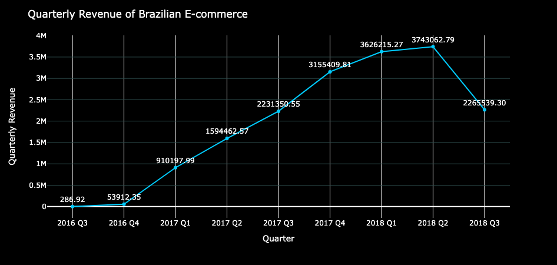
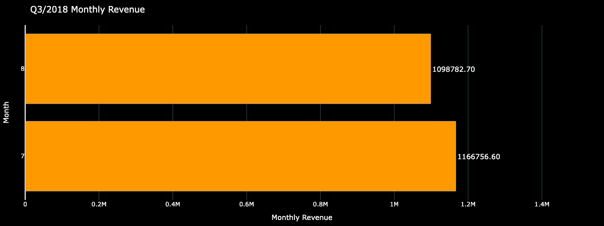
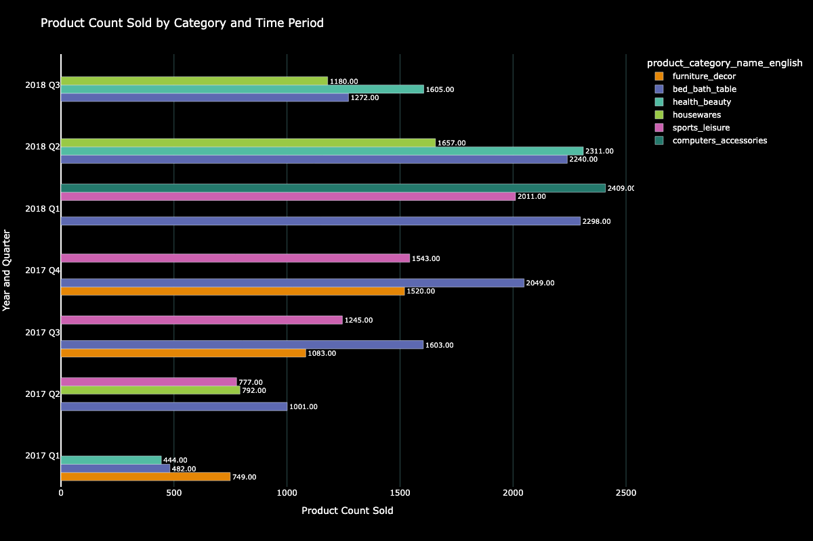
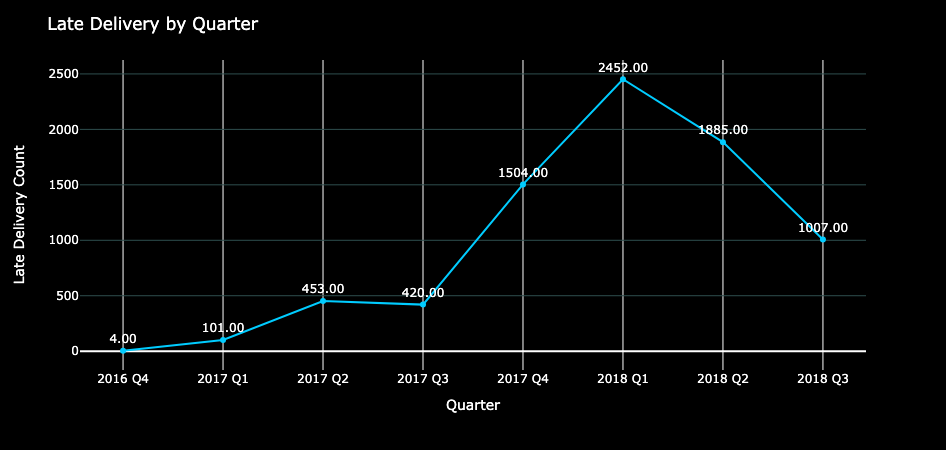
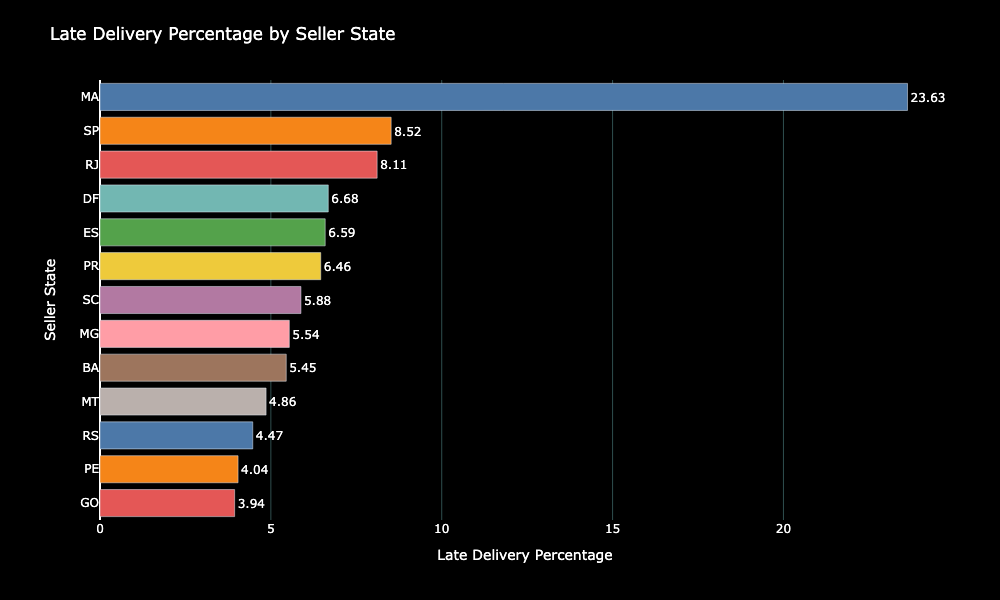
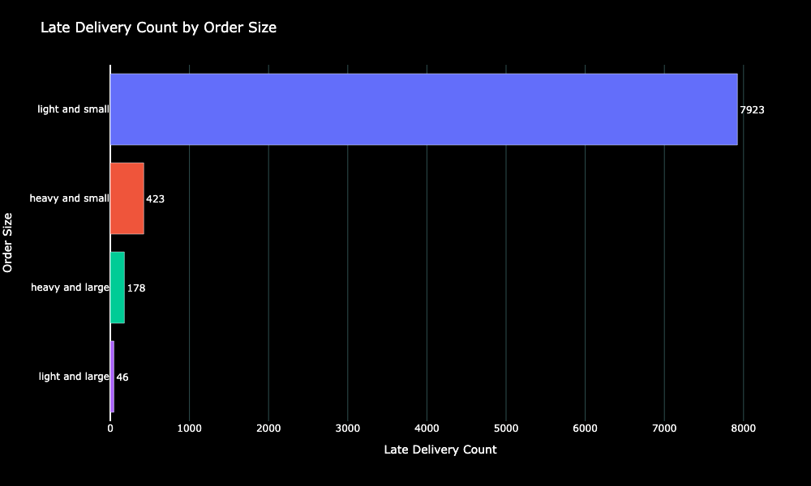

# Introduction
📊 This project analyzes Brazilian e-commerce data from 2016 to 2018, focusing on two main areas: sales trends 📈 and delivery performance 🚚. The sales analysis examines quarterly revenue to identify growth patterns and the top-selling products each quarter 🛍️. The delivery analysis investigates late deliveries to uncover potential areas for operational improvement 🔍. This study aims to provide valuable insights into both market trends and service efficiency ✨.

🔍 SQL queries? Check them out here: [Project folder](/project_sql/)
    
# Backgroud
Brazil's e-commerce market has experienced significant growth 📊 over the past few years, becoming one of the largest in Latin America. With the rapid expansion of online shopping 🛒, understanding sales trends and delivery performance is crucial for businesses looking to optimize their operations and enhance customer satisfaction. This dataset, sourced from Kaggle 📚, provides a comprehensive look at e-commerce transactions from 2016 to 2018, including detailed information on orders, products, customers, and logistics 🚚.

By analyzing this data, we can uncover patterns in consumer behavior 👥, identify top-performing products 🏆, and understand the factors contributing to late deliveries ⏰. These insights can help businesses make informed decisions to drive sales and improve service quality, ultimately enhancing the overall customer experience in the competitive e-commerce landscape 🌐.

# Tools I Used
Throughout this project, several tools were utilized to analyze and manage the data effectively:

- **SQL:** Employed for querying the data to identify insights and trends 📊.
- **PostgreSQL:** Used as the database management system to handle and organize the data 💾.
- **Visual Studio Code:** Utilized for managing and executing SQL queries, offering a streamlined coding environment 🖥️.
- **Git & GitHub:** Leveraged for version control and sharing SQL scripts and analysis, ensuring collaborative and organized project management 🌐.

# The Analysis
### Sales Analysis
The goal of analyzing the ecommerce sales data is to uncover the key factors affecting business performance. This analysis focuses on all successful orders, specifically those marked with the status "delivered."

Initially, the quarterly revenue of the entire ecommerce platform was examined to assess the growth of the business in Brazil.

The analysis reveals a significant increase in revenue throughout 2017 and the first half of 2018. However, there is a notable decline in the third quarter of 2018, with revenue dropping sharply from approximately 3.7 million to 2.2 million.

🔍 Check the query of this analysis here: [Quarterly Revenue](/project_sql/sale_analysis/quarterly_revenue.sql)

_Time series graph visualizing quarterly revenue from 2016 Q3 to 2018 Q3_

To gain a deeper understanding of the decline observed in the third quarter of 2018, the monthly revenue for this period was closely examined.

It was discovered that there is no data available for September 2018. This absence may account for the significant drop in revenue, given that the other two months in the quarter each generated substantial revenue of approximately 1 million. Further investigation is needed to understand what happened in September.

🔍 Check the query of this analysis here: [revenue in 2018 Q3](/project_sql/sale_analysis/2018_q3_orders.sql)

_Bar graph visualizing monthly revenue in 2018 Q3_

The database contains only 16 ongoing orders and no completed shipments for September 2018. It appears the data may have been truncated before all entries for this month were updated, as it is highly unlikely that only 16 orders were placed in an entire month. Therefore, it is not feasible to accurately assess the performance of Q3 2018 with the available data.

🔍 Check the query of this analysis here: [September 2018's Orders](/project_sql/sale_analysis/2018_09_orders.sql)

| Order Status |  Count  |
|:------------:|:-------:|
| On-going     |16       |
| Delivered    |0        |

_Table indicating the number of orders in September 2018_

The top three best-selling product categories for each quarter were examined to determine if there are any indications of seasonality over the seven quarters from Q1 2017 to Q3 2018. Data from 2016 was not considered in this analysis due to the relatively low revenue in that year, which would not provide meaningful insights when compared to the following two years.

Based on the visualization of the quarterly reports, there is no clear indication of seasonality due to the diversity of best-selling products in each quarter. However, some trends are observable for specific product categories:

- Products in the "bed bath table" category consistently performed well across all quarters. This suggests that further exploration into this category could provide valuable insights and help develop strategies to strengthen product offerings.
- Throughout 2017, the "sport leisure" category garnered significant interest from customers. It could be beneficial to analyze which specific products were most popular and whether these products are associated with any events during that period. This information could help the company plan special campaigns aligned with relevant events.
- The "health and beauty" category showed increased attention in the first half of 2018. Investigating market trends related to this category could reveal factors such as product launches by specific brands or celebrity endorsements that influenced consumer behavior, providing opportunities to capitalize on these trends.

🔍 Check the query of this analysis here: [Best Seller Categories](/project_sql/sale_analysis/top_categories.sql)

_Bar graph visualizing the top three best seller categories in each quarter_

### Late Delivery Analysis
Given the high volume of orders and revenue, late deliveries are a significant concern that needs to be addressed. As such, this issue is a key topic for analysis.

From the complete dataset, only 8.11% of orders were delivered late, which is relatively low considering the total number of orders. However, further exploration is warranted to gain deeper insights into this behavior.

🔍 Check the query of this analysis here: [Late Delivery Percentage](/project_sql/late_delivery_analysis/late_delivery_status.sql)

| Late Delivery Count |  Total Order Count  | Late Delivery Percentage|
|:------------:|:----------:|:---------:|
| 7826         |96478       |8.11%      |

_Table indicates the number and percentage of late delivery orders_

The time series graph below indicates a quarterly increase in the number of late delivery orders, which aligns with the substantial growth in revenue during this timeframe. However, there is a noticeable decrease in the number of late deliveries in Q2 of 2018. The data for Q3 of 2018 will not be considered in the analysis because the data for September 2018 is incomplete.

🔍 Check the query of this analysis here: [Late Delivery by quarter](/project_sql/late_delivery_analysis/late_delivery_by_quarter.sql)

_Time series graph visualizing the number of late deliveries in each quarter_

The percentage of late delivery orders in each state in Brazil was analyzed to determine if any state had a significantly higher rate than the others.

As shown in the bar graph below, Maranhão stands out with the highest percentage of late delivery orders at 23.63%, while other states only have single-digit percentages.

🔍 Check the query of this analysis here: [Late Delivery by state](/project_sql/late_delivery_analysis/late_delivery_by_state.sql)

_Bar graph visualizing the number of late delivery percentage by state_

The table below shows that the percentage of late deliveries in Maranhão increased from Q1 to Q2 of 2018, but then sharply decreased in Q3. This suggests an improvement in addressing the issue, as the total number of orders rose from 137 to 234, while the count of late orders dropped from 53 to 35.

🔍 Check the query of this analysis here: [Late Delivery in Maranhão](/project_sql/late_delivery_analysis/late_delivery_in_ma.sql)

| Quarter       |  Late Order Count  | Total Order| Late Delivery Percentage | 
|:------------:|:-------------------:|:----------:|:------------------------:|
| 2018 Q1      |7                    |31          |22.58%                    |
| 2018 Q2      |53                   |137         |38.69%                    |
| 2018 Q3      |35                   |234         |14.96%                    |

_Table indicates the percentage of late delivery order compare to the total orders in Maranhão_

Curious to see if the size and weight of an order affect delivery time, a further analysis was conducted by categorizing orders into four groups: light and small, heavy and small, heavy and large, and light and large.

As shown in the bar graph below, the majority of late deliveries fall into the "light and small" category. This suggests that the initial assumption was incorrect, and larger or heavier orders may not significantly impact late deliveries.

🔍 Check the query of this analysis here: [Late Delivery by order size](/project_sql/late_delivery_analysis/late_delivery_by_product_size.sql)

_Bar graph visualizing the late delivery count categorize by size of order_

# What I Learned
Through the analysis of ecommerce sales data, I uncovered several key factors affecting business performance. The revenue data indicated a substantial growth trend throughout 2017 and into the first half of 2018, followed by a significant decline in the third quarter of 2018. This drop in revenue was partly attributed to missing data for September 2018, making it difficult to fully assess performance for that quarter.

Examining best-selling product categories across multiple quarters revealed no clear seasonality, although consistent demand for certain categories, such as "bed bath table," suggests opportunities for targeted strategies. Seasonal interest in other categories, like "sport leisure" and "health and beauty," highlights the importance of aligning marketing efforts with market trends and events.

The analysis of late deliveries showed that while the overall percentage of late orders was relatively low, there was a trend of increasing late deliveries alongside rising order volumes. However, there was a notable improvement in late delivery rates in Maranhão during Q3 of 2018, suggesting effective interventions.

Lastly, the investigation into whether the size and weight of orders influenced delivery times revealed that most late deliveries were in the "light and small" category, contradicting the initial assumption that heavier or larger items would be more prone to delays. This finding suggests that other factors, such as logistical inefficiencies, may be contributing to late deliveries.

# Conclusion
This research aimed to analyze ecommerce sales data to identify key factors influencing business performance and customer satisfaction. The analysis revealed significant insights into revenue growth patterns, product category trends, and delivery performance. While revenue showed strong growth through 2017 and early 2018, a notable decline in Q3 2018 highlighted data gaps and potential operational challenges.

Further investigation into best-selling products did not indicate a clear seasonal pattern but suggested strategic opportunities in consistently high-performing categories. The analysis of late deliveries underscored the importance of addressing delivery logistics, especially in states like Maranhão, where late delivery rates were notably higher.

Overall, the findings provide a comprehensive view of the ecommerce platform's performance, highlighting areas for strategic focus and improvement to enhance business outcomes and customer experience. Moving forward, addressing data completeness and refining logistical operations will be critical in sustaining growth and ensuring customer satisfaction.